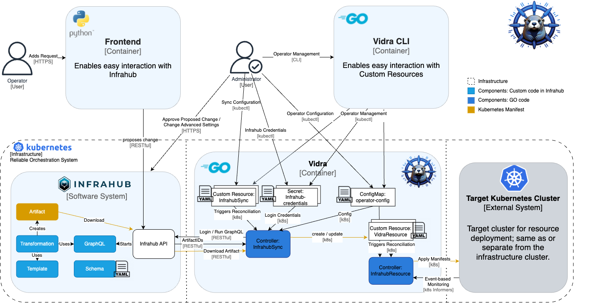

import Admonition from '@theme/Admonition';

## Introduction

Vidra is a **Kubernetes operator** that automates the synchronization and management of infrastructure resources via the Infrahub platform. It streamlines the process of querying, retrieving, and applying configuration artifacts to Kubernetes clusters, enabling efficient and automated infrastructure lifecycle management.

The architecture is modular, extensible, and resilient, following Kubernetes operator patterns and cloud-native best practices. This section describes Vidra’s core components, data flow, interactions, and design rationale.

---

## 1. Overview of Vidra Architecture

Vidra is implemented as a **Kubernetes operator**, extending the Kubernetes control plane to manage custom resources representing Infrahub synchronization configurations. The operator continuously reconciles desired states defined in Infrahub into custom resources, which are used to reconcile with the actual cluster state, ensuring automated, declarative management of Kubernetes resources.

### Key Architectural Goals:

- **Declarative Resource Management:** Users specify synchronization requirements via custom resources; Vidra automates downstream artifact application.
- **GitOps Principles:** Supports GitOps-based workflows, allowing users to define infrastructure in Infrahub and manage it through version control.
- **Extensibility:** Modular architecture enables support for additional artifact types, expanded Infrahub query capabilities, and even integration with any other system that generates manifests.
- **Scalability and Robustness:** Efficient handling of concurrent sync operations with robust error handling.
- **Separation of Concerns:** Clear boundaries between domain logic, external system integration, and Kubernetes API interactions.

---

## 2. C4 Model

The following diagrams illustrate the C4 model for Vidra, providing a high-level perspective on its architecture and interactions within the Kubernetes ecosystem.

### System Context Diagram (C1)

### Container Diagram (C2)

### Component Diagram (C3)

## High-Level Code Structure (C4)

Vidra is structured into four primary layers, each implemented as a distinct Go package to promote a clean, maintainable architecture:

### 2.1 API Layer

The **[API Layer](../api-references/api-references.md)** exposes Vidra’s functionality to users through well-defined custom resource definitions (CRDs) and their schemas.

- **InfrahubSync CRD:** The primary entry point for configuring Vidra, allowing users to specify synchronization parameters.
- **VidraResource CRD:** Defines the structure for Kubernetes resources managed by Vidra, enabling declarative management of cluster artifacts.

The API Layer can be found [here](https://github.com/infrahub-operator/vidra/tree/main/api/v1alpha1).

### 2.2 Domain Layer

The **Domain Layer** defines Vidra’s core business entities and domain interfaces. This layer is intentionally minimal, focusing all important entities primarily in the `InfrahubSync` and `VidraResource` custom resources, which represent the essential concepts and behaviors within Vidra.

The only entity in the domain layer so far is `Artifact`, which represents the Infrahub artifact that is downloaded and applied to the cluster. It contains metadata about the artifact, such as its ID, name, and checksum.

### 2.3 Controller Layer

The **Controller Layer** implements the reconciliation logic that drives Vidra’s continuous delivery workflows. Controllers monitor changes to custom resources and orchestrate the necessary actions to align cluster state with the desired state. The controller implements the use cases of the custom resources and orchestrates the necessary actions to align cluster state with the desired configuration.

- **InfrahubSyncReconciler:** Handles all tasks related to Infrahub, including authentication, querying, artifact retrieval, and triggering downstream synchronization.
- **VidraResourceReconciler:** Manages the lifecycle of Kubernetes resources, applying, updating, or deleting manifests as needed.

Each controller is dedicated to a specific CRD, ensuring clear separation of concerns and enabling future extensibility.

### 2.4 Adapter Layer

The **Adapter Layer** manages integrations with external systems, such as Infrahub and Kubernetes clusters. It handles API communication, artifact processing, and abstracts external dependencies behind interfaces, facilitating testing and future expansion.

While Kubernetes is not a direct external system, we put the actions done by additional Go clients (like talking to other clusters or handling event-based reconciliation) into the adapter layer, as they are not part of the core controller logic.

This layered approach enforces separation of concerns, simplifies testing, and enables future extensibility. Dependencies between layers are managed through interfaces, allowing for easy mocking and unit testing. Importantly, dependencies only go inward—outer layers depend on inner layers, but not vice versa—ensuring a clean, maintainable architecture.

<Admonition type="note" title="Note">
You can explore the implementation of these three layers (Domain, Controller, Adapter) in the [internal directory](https://github.com/infrahub-operator/vidra/tree/main/internal) of the Vidra repository.
</Admonition>
---

## 3. Data Flow and Interaction

1. **Custom Resource Creation (CR):**  
   Users create an `InfrahubSync` resource, specifying parameters such as the Infrahub query, target artifact, target branch, and (optionally) a target date. This resource acts as the declarative specification for what should be synchronized from Infrahub into the Kubernetes cluster.

2. **Event Trigger:** The Kubernetes API server notifies the InfrahubSync controller of the resource creation or update.

3. **InfrahubSync Reconciliation Loop:**  
   - Retrieves user and password from the Secret with annotation `infrahub-api-url: <infrahub-api-url>`.
   - Authenticates to Infrahub using configured credentials.
   - Executes the specified query (in ConfigMap `vidra-config`) on Infrahub and retrieves metadata about the resulting artifact.  
   - Downloads the artifact (e.g., a Kubernetes manifest bundle) if the checksum of the Artifact has changed.
   - Applies the artifact and its manifests each to a `VidraResource` with the artifact ID as name.
   - Updates resource status to reflect success or failure of the sync process.
   - Adds itself to a time-based reconcile queue, ensuring periodic checks for updates or changes to the InfrahubSync resource.

4. **Event Trigger:** The Kubernetes API server notifies the VidraResource controller of the resource creation or update.

5. **VidraResource Reconciliation Loop:**  
   - Monitors `VidraResource` CRs created by the InfrahubSync controller.
   - Applies the manifests to the destination Kubernetes cluster (can be a different cluster), ensuring the desired state matches the actual state.
   - Creates lists and finalizers of the managed resources, allowing for easy tracking, management, and deletion of resources or VidraResources.
   - Applies event-based reconciliation if configured to do so, where changes to the managed resources trigger reconciliation or add a time-based reconcile interval.
   - Updates resource status to reflect success or failure of the application process.
   - Adds itself to a time-based reconcile queue, ensuring periodic checks for updates or changes to the VidraResource resource.

   
---

## 4. Design Patterns and Technologies

- **Operator SDK & Controller Runtime:** Vidra leverages the Operator SDK framework, providing scaffolding for controller creation, client interactions, and CR management.
- **Domain-Driven Design (DDD) / Clean Architecture:** Clear separation between domain entities, business logic, and infrastructure concerns to improve maintainability.
- **Interface Abstraction:** External system clients (Infrahub API, Kubernetes client) are abstracted by interfaces, facilitating unit testing and mocking.
- **Reconciliation Model:** Follows Kubernetes’ declarative reconciliation paradigm, ensuring eventual consistency between desired and actual state.
- **Factory Pattern:** Used to create Go clients used to connect to other Kubernetes clusters or manage event-based scheduling, allowing for flexible configuration and easy testing.
- **Exponential Backoff:** Implements retry logic for transient errors during API calls (Infrahub and K8s), enhancing resilience against temporary failures.
- **Finalizers:** Utilized to manage resource cleanup and prevent premature deletion of resources while they are still being processed.
- **Event-Driven Architecture:** Controllers respond to Kubernetes events, leveraging a Kubernetes concept called `Informers`, triggering reconciliation based on resource changes and ensuring timely updates and synchronization.
---

## 5. Error Handling and Resilience

Vidra implements comprehensive error handling strategies:

- Transient failures during API calls trigger retries with exponential backoff.
- Validation errors halt reconciliation with clear status messages, which are stated in the resource status.
- Unexpected errors are logged and surfaced in resource conditions, enabling operators to diagnose issues.
- Concurrency controls (mutexes) prevent conflicting Go client creation.

---

## 6. Extensibility and Future Directions

The modular architecture of Vidra allows:

- Adoption of additional artifact types, enabling reconciliation of any Kubernetes resource—including custom resources (CRs).
- Addition of new Infrahub query capabilities.
- Integration with other systems (e.g., Helm, GitOps) through the Adapter Layer.

This design ensures Vidra can evolve to meet growing infrastructure automation demands and diverse deployment scenarios.