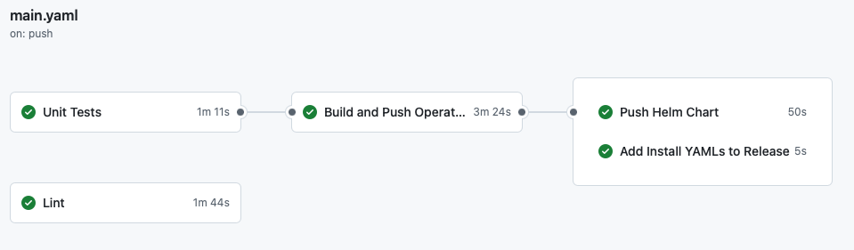

import Admonition from '@theme/Admonition';

# Continuous Integration

We use **GitHub Actions** as our CI/CD tool to automate testing, building, and documentation deployment for the **Vidra Operator**. Currently, we maintain three workflows:

  

    <ul>
      <li><strong>Deploy Docs</strong></li>
      <li><strong>Operator CI</strong></li>
      <li><strong>Operator CLI</strong></li>
      <li><strong>Code Quality and Security Checks</strong></li>
    </ul>
  

  

## Deploy Docs

The **Deploy Docs** workflow automates the deployment of our Docusaurus documentation site to GitHub Pages whenever documentation files are updated. In addition to publishing the static site, it generates up-to-date API documentation for our Custom Resource Definitions (CRDs) using `crd-ref-docs` (invoked via a `Make` target). The workflow builds the static site—including the auto-generated docs and site—and pushes the result to the `gh-pages` branch, ensuring that users always have access to the latest documentation. 

### Trigger

- Any push to the `main` branch that affects documentation files.
- Specifically triggered when:
  - A file in the `docs/` directory is changed.

Check the [`docs.yaml`](../../../.github/workflows/docs.yaml) workflow file for detailed configuration.

---

## Operator CI

This workflow handles linting, testing, building, publishing and releasing the Vidra Operator to the GitHub Container Registry and Github itself.

### Trigger

- Every push to a pull request or push to the `main` branch (protected).
- If any file coresponding to the operator is changed.
- Pushing a version tag (e.g., `v0.0.3`) will trigger the build and release process. Version is also tracked in the `Makefile`.

You can find the workflow definition in [`main.yaml`](../../../.github/workflows/main.yaml).

### Lint and Test

- Uses **golangci-lint** to perform static code analysis and linting on the Vidra Operator codebase.
- Executes all tests for the Vidra Operator using `go test` and Ginkgo-based test suites.
- Tests are run using `envtest` to provide a realistic Kubernetes API server.
- A test coverage report is generated and uploaded to **Codecov**.
- Pull requests where the code coverage drops below **80%** will or the new line of code are not covered by tests will have a warning comment added by the `codecov` GitHub Action.

  <Admonition type="note" title="Note">
  The Codecov badge in the README reflects the current coverage status.
  </Admonition>

### Build and Publish the Operator

- Uses the official **Docker GitHub Actions** to build the Vidra Operator image.
- Pushes the image to the **GitHub Container Registry (GHCR)**.
- The image is tagged with the current version (e.g., `v0.0.3`).
- The operator bundle is generated using `Make bundle-build` and published to the GitHub Container Registry.
- The images are signed using **cosign**, allowing users to verify its authenticity and integrity.

### Helm Chart
- Helmify is used to generate a Helm chart from the operator manifests, which is also published to the GitHub Container Registry.
- The Helm chart is versioned and tagged with the same version as the operator image.
- The Helm chart is automatically published to the GitHub Registry, making it easy for users to install the Vidra Operator using Helm. (OCI install)
- The packaged Helm Release and its index.yaml are also published to the `gh-pages` branch of the repository and added to the release, allowing users to install the operator using the Helm repository.

### Add Yaml files to the release
- The yaml files used for the install using OLM (Operator Lifecycle Manager) are added to the release with the correct version as well. This allows users to install the operator using OLM by applying the `catalogsource.yaml` and `subscription.yaml` files. 

---
## Operator CLI
This workflow is responsible for building and testing the Vidra Operator CLI tool, which provides a command-line interface for interacting with the Vidra Operator.

### Trigger
- Every push to a pull request or push to the `main` branch (protected).
- If any file corresponding to the operator CLI is changed.
You can find the workflow definition in [`cli.yaml`](../../../.github/workflows/cli.yaml).

### Lint and Test
- Uses **golangci-lint** to perform static code analysis and linting on the Vidra Operator CLI codebase.
- Executes all tests for the Vidra Operator CLI using `go test` and Ginkgo-based test suites.

### Build and Publish the CLI
- Uses the official **Docker GitHub Actions** to build the Vidra Operator CLI image.
- Pushes the image to the **GitHub Container Registry (GHCR)**.
- The image is tagged with the current version (e.g., `v0.0.3`).
- The CLI is built and packaged as a binary, which is also published to the GitHub Releases.
- The CLI binary is signed using **cosign**, allowing users to verify its authenticity and integrity.

---

## Code Quality and security Checks

- **Dependabot** is configured to automatically create pull requests for dependency updates of packages used in the operator.
- **CodeQL** is used to perform static code analysis and security checks on the codebase. It scans for vulnerabilities and potential issues in the code, helping maintain a high standard of code quality and security.
---

